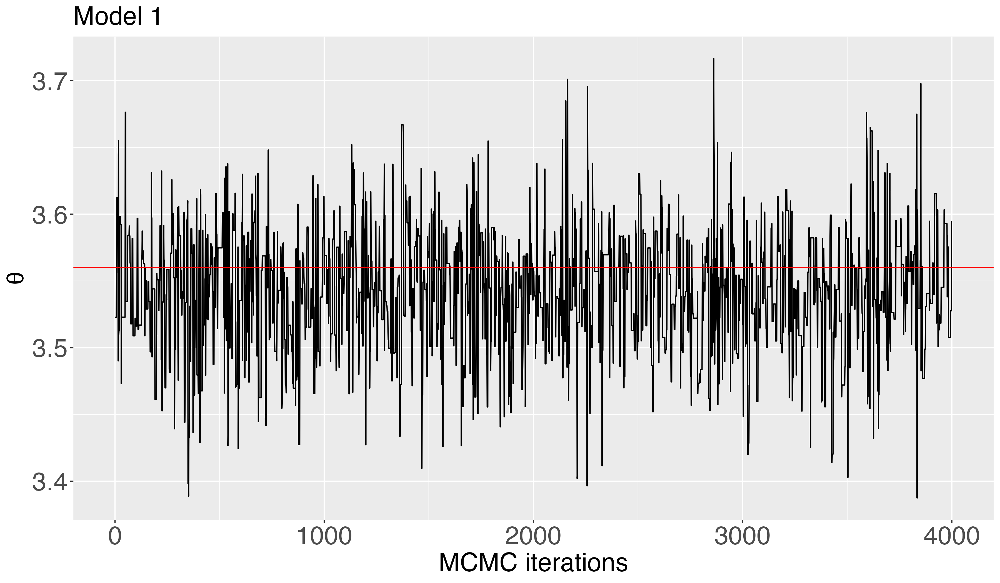

R package to implement orthogonal calibration proposed in [https://arxiv.org/abs/2404.03152] by Chakraborty et. al. To install the package, first install the "devtools" package using install.packages("devtools"). Then use install_github("antik015/Ocal").

Figures 1(a) - 1(c) and 2(a), 2(b) can be reproduced by running the reproducible_examples.R file. 

An example is given below: the data generating model is $y_R(x) = 4x + x\sin 5x + \epsilon$ where $\epsilon \sim N(0, 0.2^2)$. The computer model is $f(x, t) = tx$. The point at which the computer model produces the best approximation is $\theta^\star = 3.56$.

### Preliminary package loading
```
install.packages("pracma")
install.packages("BART")
install.packages("BASS")
install.packages("mvtnorm")
install.packages("ggplot2")
install.packages("latex2exp")
install.packages("cvCovEst")
library(pracma)
library(BART)
library(BASS)
library(mvtnorm)
library(cvCovEst)
library(OCal)
library(ggplot2)
library(latex2exp)
font_size = 22
My_Theme = theme(axis.title.x = element_text(size = font_size),axis.text.x = element_text(size = font_size),
                 axis.title.y = element_text(size = font_size), axis.text.y = element_text(size = font_size), 
                 legend.text = element_text(size = font_size), legend.title = element_text(size = font_size), plot.title = element_text(size = 22))

```
### Code to reproduce Figure 1(a)
```
### Figure 1(a) ###
n = 100
sigT = 0.2
real_type = 1

sim_data = gen_data(n, real_type, sigT)
y = sim_data$y
x = sim_data$x
computer_model_functions = list()
computer_model_functions[[1]] = sim_data$f
computer_model_functions[[2]] = sim_data$g
nmcmc = 5000
burnin = 1000
phi_sq = 1
m = 15
nugget = 0
alpha = 0.95
MH_sd = 0.2 
prior_sd = 10
phi_sq = 1
# res1 = posterior_projection(y, x, phi_sq, nu = 1/2, psi = 1/2, nmcmc, burnin, sigT, m, "GP", "infinite", computer_model_functions, nugget, alpha, MH_sd, prior_sd)
# res2 = posterior_projection(y, x, phi_sq, nu = 3/2, psi = 1/2, nmcmc, burnin, sigT, m, "GP", "infinite", computer_model_functions, nugget, alpha, MH_sd, prior_sd)
# res3 = posterior_projection(y, x, phi_sq, nu = 5/2, psi = 1/2, nmcmc, burnin, sigT, m, "GP", "infinite", computer_model_functions, nugget, alpha, MH_sd, prior_sd)
res4 = posterior_projection(y, x, phi_sq, nu = 3/2, psi = 1/2, nmcmc, burnin, sigT, m, "BART", "infinite", computer_model_functions, nugget, alpha, MH_sd, prior_sd)

df = data.frame(theta = t(res4$thetaout))
pl1 = ggplot(df) + geom_line(aes(x = 1:4000, y = theta), linewidth = 0.5) + xlab("MCMC iterations") + ylab(TeX("$\\theta$"))
pl1 = pl1 + geom_hline(yintercept = 3.56, col = "red", linewidth = 0.5) 
pl1 = pl1 + ggtitle("Model 1") + My_Theme
pl1
```

### Here is the posterior distribution 

